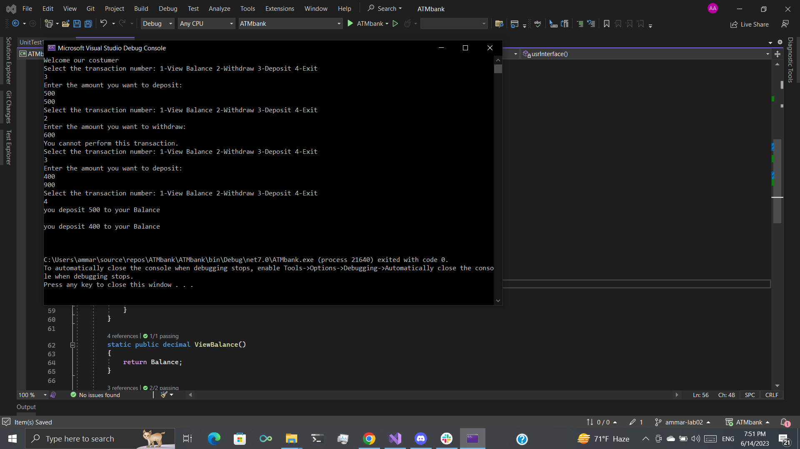

# ATMbank

im this ATMbank app you can despoit or withdraw or just check your balace by select the number for transaction 

In this app you can despoit or withdraw or just check your balace by select the number for transaction 
and there are things you can not do it like deposit or withdraw negative value and you can not withdraw more than your balace and if you choose to end the program it will render all your process that you did it 

 provide some xunit test to make sure that the program will doing it work well 
 
